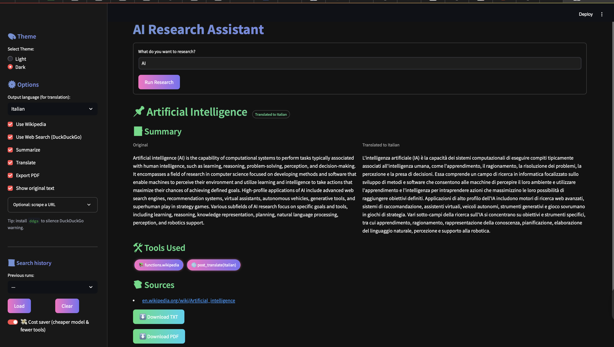

# AI Research Assistant

> An **AI-powered conversational research assistant** built with **LangChain**, **OpenAI**, and **Streamlit**.  
It helps you **search, summarize, translate, and export information** into structured reports — all in one place.



---

## Features

-  **Conversational AI** powered by OpenAI's GPT-4o  
-  **Integrated tools**:
  - Wikipedia & DuckDuckGo search  
  - Text summarization (Hugging Face `transformers`)  
  - Translation via `deep_translator`  
  - Export research results to PDF  
  - Save structured responses to file  
-  **Context-aware** responses using LangChain's `ConversationBufferMemory`  
-  Clean, **Streamlit-based UI**  

---

##  Use Case

Enter a research topic (e.g., *"The Renaissance"*) and the assistant will:  
1. Search multiple reliable sources  
2. Summarize key insights  
3. Provide a concise, structured explanation  
4. Export results and tools used into a **PDF report**

---

## 🛠️ Tech Stack

- [LangChain](https://www.langchain.com/)  
- [OpenAI API](https://platform.openai.com/)  
- [Streamlit](https://streamlit.io/)  
- [Transformers](https://huggingface.co/transformers/)  
- [Deep Translator](https://pypi.org/project/deep-translator/)  
- [FPDF](https://pyfpdf.github.io/)  

---

## Quick Start

```bash
# 1. Clone the repository
git clone https://github.com/letiziacastello/ai-research-assistant.git
cd ai-research-assistant

# 2. Create a virtual environment
python -m venv .venv
source .venv/bin/activate   # On Windows: .venv\Scripts\activate

# 3. Install dependencies
pip install -r requirements.txt

# 4. Set up API key in .env file
OPENAI_API_KEY=your_openai_key_here

# 5. Launch the app
streamlit run app.py
